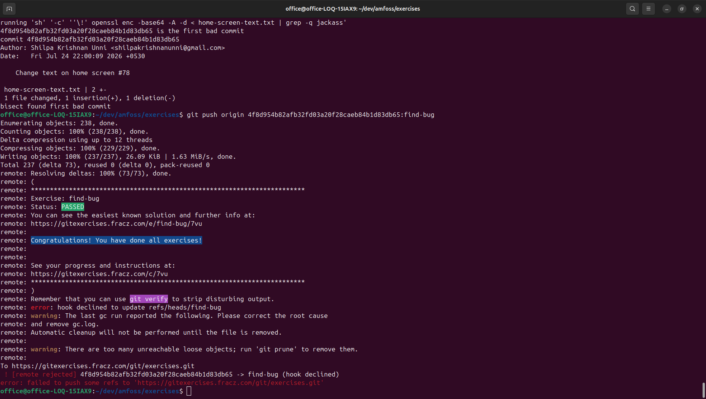

# Task - 01 : Git Exercises
read through ./configure.sh before executing it. script files can be dangerous.
exercises seem straightforward enough
never solved a merge conflict via cli before, so that was new. id alwasy used the ide interface.
everything else was straightforward.

 