## Loguetown Reef

checked out the sh file first. i see 
'''
if [[ -x "$FRUIT" ]];
'''
checks if the file exists and is executable.
so im looking for an executable file. 
i use `ll sector_X` on all the folders to find a file with executable permission.

found it inside sector_C

AWAKENING_SIGNATURE:

ONE_PIECE{GITO_GITO_NO_AWAKENING}

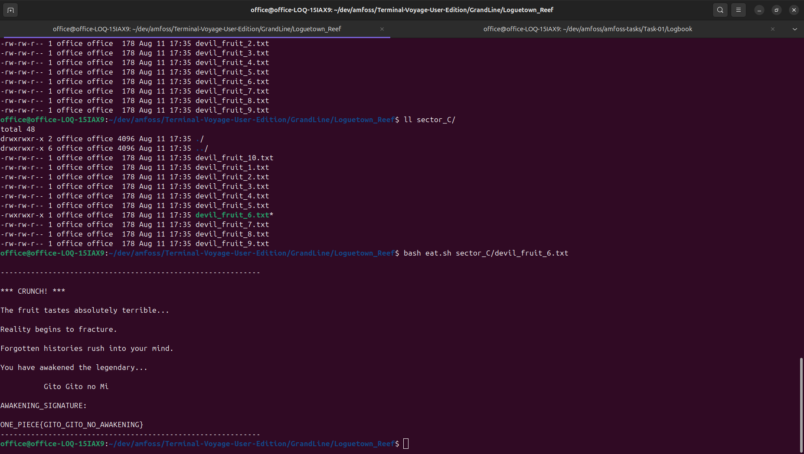

## Whiskey Peak

i `cat` the `feast_manifest.txt`

```
cat -A feast_manifest.txt 
Item 01: 50 Barrels of Bink's Sake$
Item 02: Roasted Sea King Meat$
```

i try `ll`, `file feast_manifest.txt`, `xxd feast_manifest.txt`
nothing.

i go to the one piece wiki and read the arc. nothing.

i leave for now.

## Wax Jungle
only a .gitkeep file at first glance
i run `git branch`, then `git fetch --all`, then `git branch` again.
found the alternate timelines.
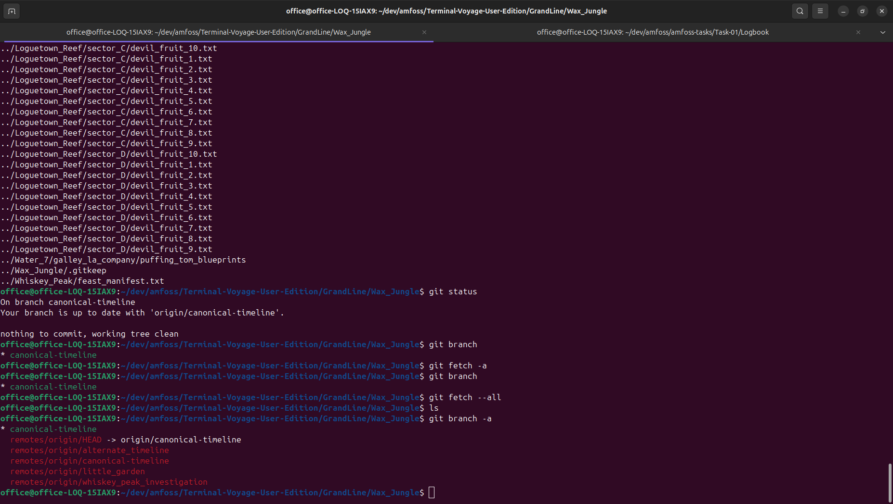

## Return to Whiskey Peak
`git switch --track origin/whiskey_peak_investigation`
i see the script file now
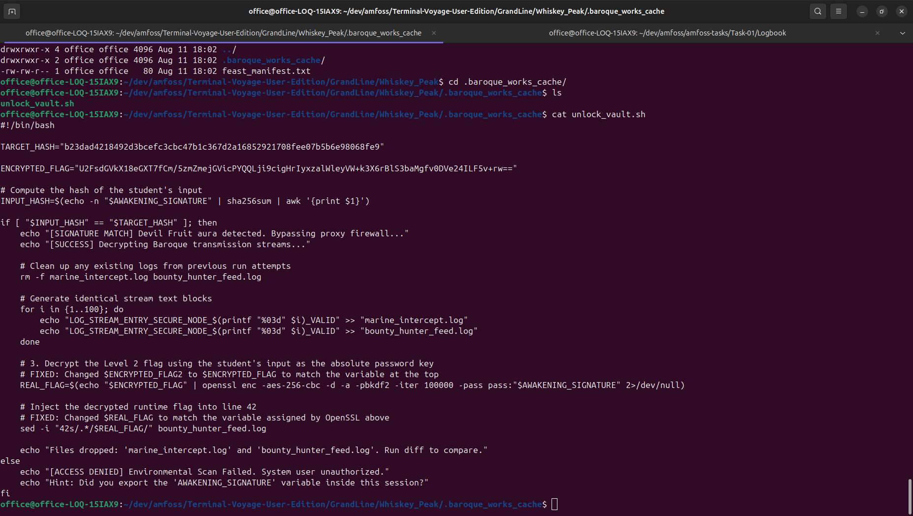

i export the `AWAKENING_SIGNATURE` and run the script file.

i google the command to diff two files. but, like, the sh file already tells me the difference is on line 42.

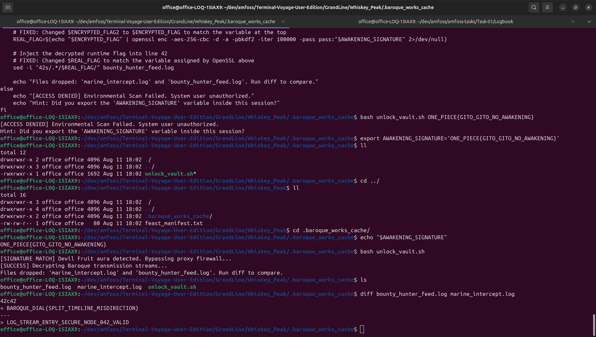

saving that.

## Return to Wax Jungle
`git switch --track origin/little_garden`

lots of files in here.
`find . -type f | sort`

i find an interesting file:

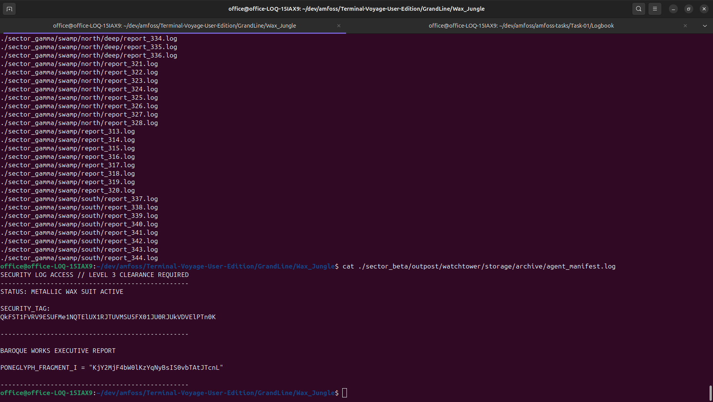

base64 decoding SECURITY_TAG gives me `BAROQUE_DIAL{SPLIT_TIMELINE_MISDIRECTION}`
cant decode PONEGLYPH_FRAGMENT_I, but i assume theres more fragments like this one.

## Water 7
`git switch alternate_timeline`

```
file puffing_tom_blueprints
puffing_tom_blueprints: gzip compressed data, was "step2_blueprints.tar", last modified: Mon Jul 20 17:02:24 2026, from Unix, original size modulo 2^32 10240
```

i find the zip file of blueprints inside `./Water_7/galley_la_company`. not unzipping that just yet. i'll poke around a bit.

also, `was "step2_blueprints.tar"` -> `"every object remembers what it truly is."`. oh, i get it now. it was renamed.

```
tar -tzvf puffing_tom_blueprints
-rw-r--r-- rogueone/rogueone 935 2026-07-20 22:32 step1_blueprints.zip
```

let's look inside.

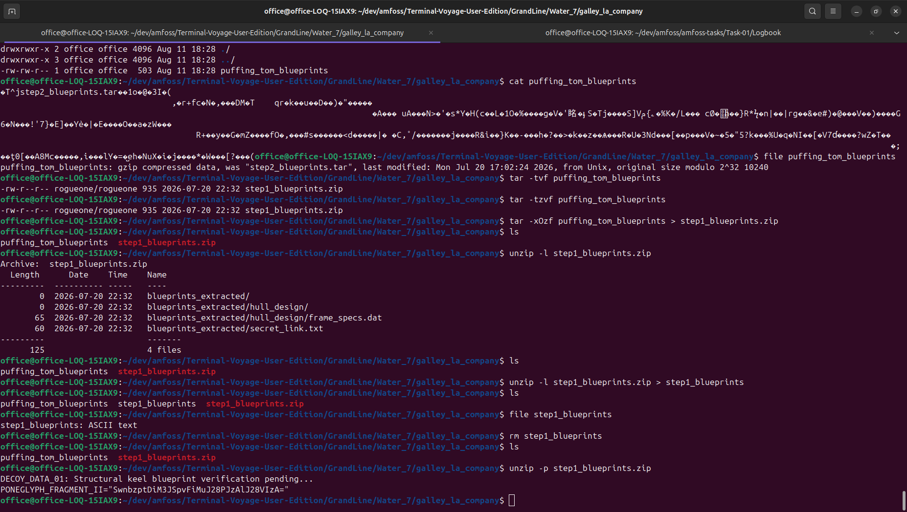

fragment two found.

## BUSTER CALL TIMELINE RECOVERY
this is git history, isn't it.

i run `git log --oneline --all --decorate --graph`

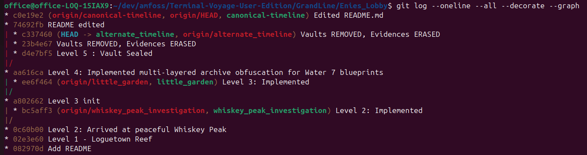


let me take a closer look at that commit, Vault Sealed, "the last peaceful moment before destruction".

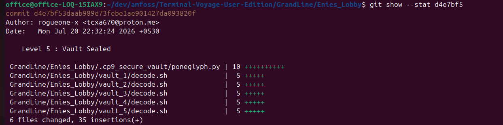

`git show` tells me the `decode.sh` files are decoys.

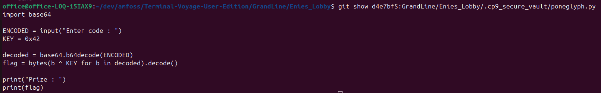

i combine the fragments and run the py file. new github link.

## THE GREAT MERGE WAR AT LAUGH TALE
...this is merge conflicts.

let's go.

`git log --oneline --all --decorate --graph` doesn't reveal much.

let's compare the two branches.

`git diff ancient_history..origin/pirate_king_path`

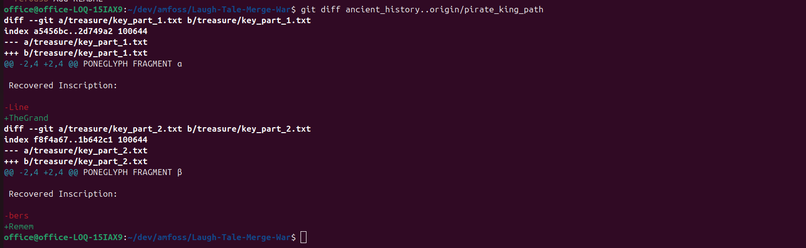

i fix the merge conflicts.

next, i take a peek at `victory.sh`

looks safe. i run it, input the merged combination from the text files.

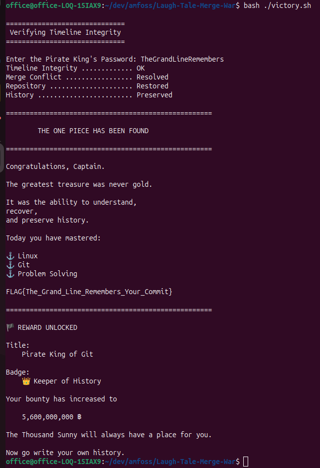  